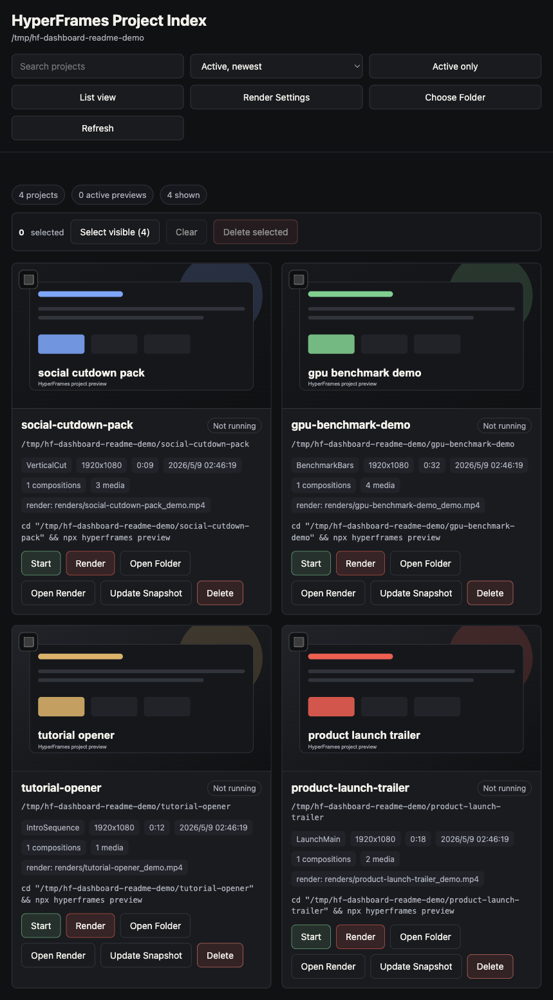
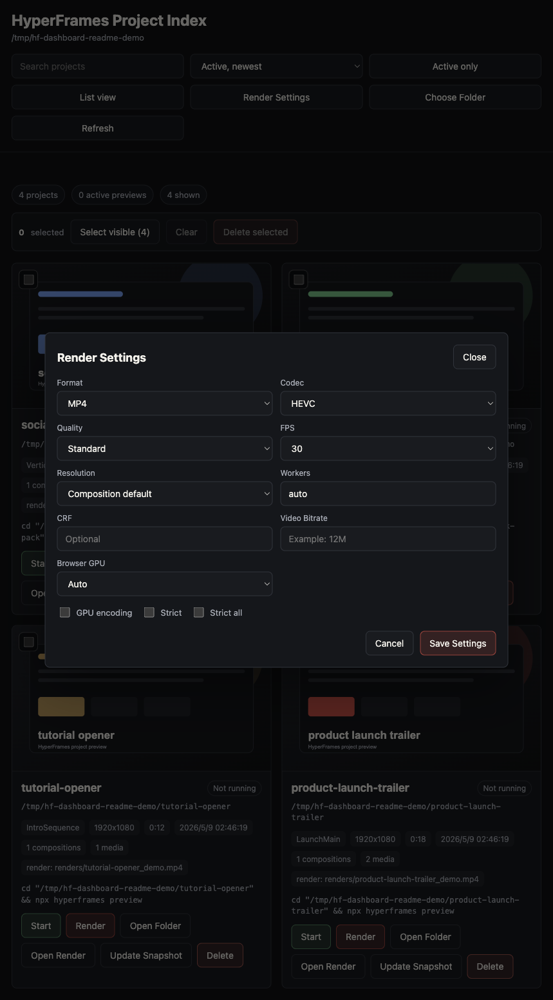

# HyperFrames Project Dashboard

A local dashboard for managing many HyperFrames projects from one browser tab.

简体中文说明: [README.zh-CN.md](README.zh-CN.md)

HyperFrames has a great single-project Studio via `hyperframes preview`, but it does not currently ship a parent-folder project index. This tool fills that gap for local production work: scan a folder of projects, start or stop previews, open renders, generate thumbnails, render videos, and move old projects to Trash.

## Screenshots





## Features

- Multi-project index for a parent folder of HyperFrames projects.
- Sort by active status, newest, oldest, or name.
- Search and Active-only filtering.
- Grid and vertical list card layouts.
- Start and Stop preview servers using the official `npx hyperframes preview` flow.
- Open Studio, project folder, or latest render.
- Generate or refresh thumbnails from contact sheets, snapshots, latest render frames, or `hyperframes snapshot`.
- Render videos directly from a project card.
- Render settings with MP4, WebM, MOV, quality, FPS, resolution, workers, GPU flags, strict mode, CRF, and bitrate.
- Default video output is MP4 + HEVC. HyperFrames renders a native MP4 first, then the dashboard transcodes it to HEVC with `ffmpeg`.
- Single and bulk delete. Deletes are moved to Trash or Recycle Bin where the OS supports it.
- Persists the last selected root and render settings in `~/.hyperframes-project-dashboard/config.json`.

## Requirements

- Node.js 20 or newer.
- HyperFrames CLI available through `npx hyperframes`.
- `ffmpeg` for thumbnail extraction from videos and HEVC transcoding.
- macOS or Windows for the native folder picker.

Linux can run the server too, with `zenity` or `kdialog` for the folder picker and `xdg-open` for opening files.

## Run

Clone the repo, then:

```bash
npm install
npm start -- --root /path/to/your/HyperFrames/projects
```

Or run with the short command after linking locally:

```bash
npm link
hf-dashboard --root /path/to/your/HyperFrames/projects
```

Then open the printed local URL, usually:

```text
http://localhost:4599
```

You can also set the root with an environment variable:

```bash
HYPERFRAMES_DASHBOARD_ROOT=/path/to/projects npm start
```

## Folder Layout

The selected root should contain HyperFrames projects as first-level subfolders:

```text
Hyperframes/
  project-a/
    index.html
  project-b/
    index.html
```

The dashboard validates the folder by checking for at least one child folder with `index.html`.

## Rendering

Click `Render Settings` to set the default export options. Each card has a `Render` button that writes to that project's `renders/` folder.

Default:

- Format: MP4
- Codec: HEVC
- Quality: Standard
- FPS: 30

HEVC output uses a two-step flow:

1. `npx hyperframes render` creates a native MP4.
2. `ffmpeg` transcodes that MP4 to HEVC with the `hvc1` tag.

On macOS, the dashboard first tries `hevc_videotoolbox`. If that fails, or on other platforms, it falls back to `libx265`.

## Delete Safety

Single delete requires typing the project name. Bulk delete requires typing `DELETE`.

On macOS and Linux, projects are moved to a Trash folder with a timestamped name. On Windows, the dashboard attempts to use the Recycle Bin through PowerShell. If that fails, it falls back to a dashboard-managed trash folder under `~/.hyperframes-project-dashboard/trash`.

## Notes

- This is a local-only tool bound to `127.0.0.1`.
- It does not replace HyperFrames Studio. It launches and manages Studio previews across multiple local projects.
- Render jobs are tracked in memory while the dashboard server is running. Completed video files remain in the project `renders/` folder.

## License

MIT
